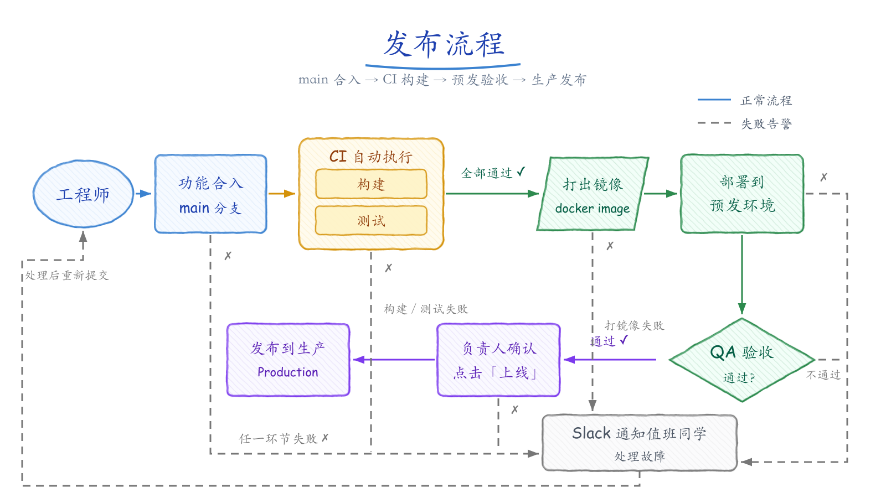

# skill-forge

A personal forge of agent skills — distilled, reusable workflows written
once against the open [Agent Skills standard](https://agentskills.io/specification)
and usable in **Claude Code**, **OpenAI Codex CLI**, and **pi**. Each skill
is one plugin, versioned and installable on its own.

## Skills

| Skill | What it does |
|---|---|
| [`sf-svg-handdrawn`](plugins/sf-svg-handdrawn/) | Hand-drawn style SVG flowcharts & diagrams from plain-language descriptions (CN/EN), with aspect-ratio control and a built-in render-and-inspect verification loop. |
| [`sf-task-scheduler`](plugins/sf-task-scheduler/) | Delayed & multi-step tasks on a schedule with crash-safe resume: task records under `.tasks/`, one-shot triggers, checkpointed journal — an interrupted run continues instead of restarting. |
| [`sf-scroll-site-clone`](plugins/sf-scroll-site-clone/) | Forensically replicate a website's scroll-driven effects (GSAP/Lenis/Three.js) into a fresh React+Vite project: dump the real source as the single authority, port animation code verbatim, pre-fill ALL content with mock data (zero network assets), verify with numeric assertions + screenshot inspection. |
| [`sf-web-video-presentation`](plugins/sf-web-video-presentation/) | Turn an article or narration script into a click-driven 16:9 "looks like video" web presentation (Vite + React + TS): script + outline in one pass, hard alignment checkpoints, per-chapter development with `narrations.ts` as the single source of truth, optional TTS audio and one-take `?auto=1` screen recording. Distilled from [ConardLi/garden-skills](https://github.com/ConardLi/garden-skills) (MIT). |

Example output (release pipeline, eval case 1):



## Install

### Claude Code (marketplace — recommended)

```text
/plugin marketplace add Yujiaqi-1m/skill-forge
/plugin install sf-svg-handdrawn@skill-forge
```

Pick a scope when prompted — **user** (`~/.claude/settings.json`, all your
projects) or **project** (`.claude/settings.json`, shared with
collaborators). After installing, run `/reload-plugins` if the summary asks
you to.

Manual invocation: `/sf-svg-handdrawn:sf-svg-handdrawn`. Natural-language
triggering usually needs no slash command — describing what you want is
enough.

<details>
<summary>Alternative: local plugin dir</summary>

```bash
git clone https://github.com/Yujiaqi-1m/skill-forge.git
claude --plugin-dir ./skill-forge/plugins/sf-svg-handdrawn
```
</details>

### Codex CLI / pi

```bash
git clone https://github.com/Yujiaqi-1m/skill-forge.git
cd skill-forge
./scripts/install.sh --agent codex   # symlinks into ~/.agents/skills
./scripts/install.sh --agent pi      # copies into ~/.agents/skills
```

- **Codex** picks user skills up from `~/.agents/skills/` on the next run
  (implicit invocation via the skill description, or `$skill-name`). The
  committed `.agents/skills/` symlinks also give repo-scope discovery to
  any Codex session started **inside** this clone — no install needed.
- **pi** reads the same directory but **does not follow symlinks**
  (verified v0.80.6), so the script installs real copies — re-run it after
  `git pull` to refresh (`--force` overwrites a stale copy). Skills then
  register as `/skill:sf-svg-handdrawn`. One-off without installing:
  `pi --skill ./plugins/sf-svg-handdrawn/skills/sf-svg-handdrawn`.

No symlink support on your filesystem? Add `--copy` anywhere. See
[docs/agent-compatibility.md](docs/agent-compatibility.md) for the full
discovery-path matrix, verified limitations, and design rationale.

## Usage

Once installed, just ask in Chinese or English — one example per skill:

- 「帮我画个流程图：代码合入 main 后 CI 跑构建和测试，通过后部署预发，QA 验收完再上生产，失败就通知值班」
  → `sf-svg-handdrawn` renders a hand-sketched SVG (wobbly edges, hatching,
  handwriting fonts), rasterizes it, visually inspects the result, and
  iterates until it passes.
- 「复刻这个网站的滚动效果：\<award-site URL\>」 / "rebuild this landing
  page's animations"
  → `sf-scroll-site-clone` dumps the site's real source, ports the animation
  code verbatim into a fresh React+Vite project, pre-fills all content with
  mock data, and asserts computed styles numerically before delivering.
- 「把这篇文章做成视频」 / "make this article into a video"
  → `sf-web-video-presentation` produces a click-driven 16:9 presentation:
  script + outline in one pass, per-chapter development, optional TTS
  audio, one-take `?auto=1` screen recording.
- 「下午 5 点帮我跑测试，跑完把报告发我」
  → `sf-task-scheduler` writes a task record under `.tasks/`, arms a one-shot
  trigger, then executes step by step with a checkpointed journal — an
  interrupted run resumes instead of restarting.

Every skill verifies its own output before reporting (render-and-read,
numeric assertions, dry-run) — that's a house rule, see below.

## Repository layout

```
skill-forge/
├── .claude-plugin/marketplace.json        # Claude Code marketplace manifest
├── .agents/skills/<name>                  # committed symlinks -> plugins/<name>/skills/<name>
│                                          #   (native repo-scope discovery for Codex)
├── plugins/<name>/                        # one plugin per skill — SOURCE OF TRUTH
│   ├── .claude-plugin/plugin.json         # plugin metadata + version
│   └── skills/<name>/
│       ├── SKILL.md                       # entry point (<500 lines, Agent Skills standard)
│       ├── references/                    # loaded on demand
│       └── evals/evals.json               # regression prompts
├── scripts/
│   ├── validate.sh                        # lint all skills (run before pushing)
│   ├── install.sh                         # expose skills to claude/codex/pi
│   └── new-skill.sh                       # scaffold a new skill
├── templates/skill/                       # scaffold templates
└── docs/agent-compatibility.md            # multi-agent design decisions + facts
```

## Adding a new skill (conventions)

1. **Scaffold**: `./scripts/new-skill.sh <name> "one-line description"` —
   creates the plugin dir from `templates/skill/`, the `.agents/skills`
   symlink, and the marketplace registration. The `sf-` prefix is added
   automatically if missing.
2. **Every skill name starts with `sf-`**: installed skills live side by
   side with skills from other sources (`~/.agents/skills/`, plugin
   listings), so the prefix keeps the origin visible in every agent.
3. **SKILL.md stays lean** (target <500 lines): workflow + rules + minimal
   template. Push copy-ready detail (snippets, palettes, tables) into
   `references/` and cite section numbers from the body.
4. **Write `description` as a router**: capability + explicit trigger
   phrases (Chinese and English) + style boundary. It is the only part
   permanently in context in every agent; the body loads on trigger.
5. **Encode decisions, not vibes**: exact fonts, hex values, commands, and
   defaults. Rules come from observed failures and carry their why; repeat
   critical rules across sections.
6. **Build in verification**: the skill must check its own output with a
   tool (render-and-read, test-run, dry-run) before delivering — phrased
   agent-neutrally, never a harness-specific tool name.
7. **`evals/evals.json` is mandatory**: 3-5 prompts covering distinct shapes
   of the task (languages, ratios, branching…), with qualitative expected
   outcomes. Re-run them after any skill edit.
8. **English everywhere in the repo** (code, docs, commit messages); trigger
   phrases in `description` may be Chinese — they are functional.
9. **Bump `plugin.json` version** whenever skill content changes.

Validate locally before pushing:

```bash
bash scripts/validate.sh            # repo conventions + Agent Skills standard
claude plugin validate ./plugins/<name>   # Claude-side manifest check
```

CI (`.github/workflows/validate.yml`) runs `validate.sh` on every push/PR.

## Skill roadmap

Candidates for future forge additions, in priority order:

**Distill existing workflows** (already proven as local commands/skills):

- `sf-code-review-zh` / `sf-perf-profiler` / `sf-refactor-advisor` — port the local
  slash commands into portable SKILL.md form.
- `sf-reading-guide` — turn a shared article into an OKR-based learning plan
  with gap analysis and SVG visualizations (synergizes with sf-svg-handdrawn).
- `sf-research-figure` — publication figures: LaTeX TikZ method pipelines and
  Blender 3D renders.

**Generic engineering** (high reuse, easy self-verification):

- `sf-commit-crafter` — diff → conventional commit message + PR description.
- `sf-changelog-forge` — git history → release notes.
- `sf-slide-deck` — markdown → Marp slides with render-and-inspect loop.
- `sf-table-wrangler` — CSV cleaning/transformation with row-count verification.
- `sf-regex-forge` — regex construction validated against test cases.

Every skill follows the house rules above: <500-line SKILL.md, `references/`
for copy-ready detail, 3-5 evals, built-in self-verification.

## Attribution & license

- `sf-svg-handdrawn` is an independent rewrite distilling techniques popularized
  by [chingswy/Skill-Research-Figure](https://github.com/chingswy/Skill-Research-Figure)
  (feTurbulence sketch filter, hatch fills, Ma Shan Zheng + Comic Sans font
  pairing). No text was copied from the source.
- Everything here is released under the [MIT license](LICENSE).
